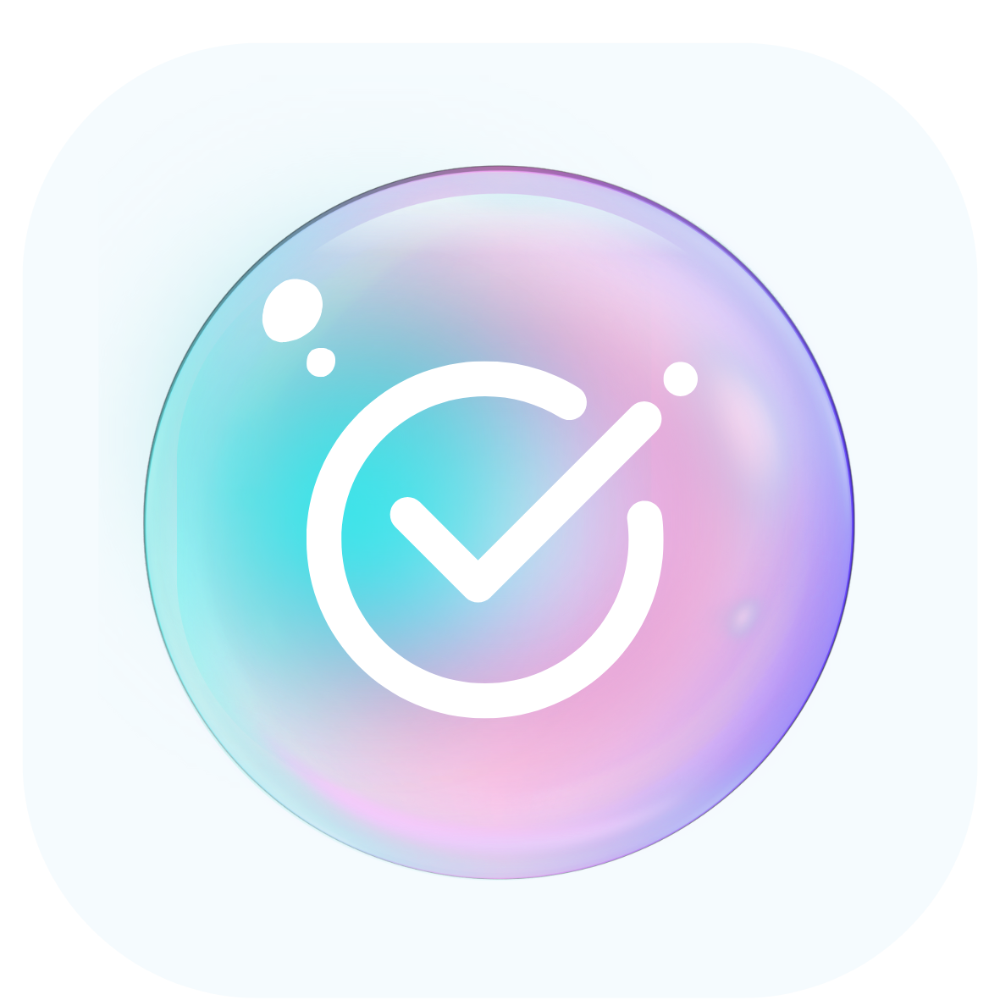
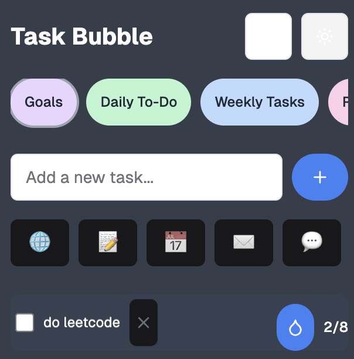
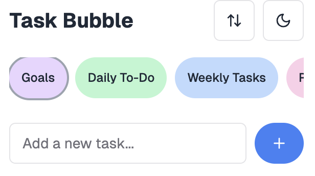

# TaskBubble 

&nbsp;&nbsp;&nbsp;&nbsp;&nbsp;&nbsp;&nbsp;&nbsp;&nbsp;&nbsp;&nbsp;&nbsp;&nbsp;&nbsp;&nbsp;&nbsp;&nbsp;&nbsp;&nbsp;&nbsp;&nbsp;&nbsp;&nbsp;&nbsp;&nbsp;&nbsp;&nbsp;&nbsp;&nbsp;&nbsp;&nbsp;&nbsp;&nbsp;&nbsp;&nbsp;&nbsp;&nbsp;&nbsp;&nbsp;&nbsp;&nbsp;&nbsp;&nbsp;&nbsp;&nbsp;&nbsp;&nbsp;&nbsp;&nbsp;&nbsp;&nbsp;&nbsp;&nbsp;&nbsp;&nbsp;&nbsp;&nbsp;&nbsp;&nbsp;&nbsp;&nbsp;&nbsp;&nbsp;&nbsp;&nbsp;&nbsp;&nbsp;&nbsp;&nbsp;&nbsp;&nbsp;&nbsp;&nbsp;&nbsp;&nbsp;&nbsp;&nbsp;&nbsp;&nbsp;&nbsp;&nbsp;&nbsp;&nbsp;&nbsp;&nbsp; 

**TaskBubble** is a simple and visually pleasing productivity app for macOS. I’ve been working on Task Bubble, a Swift-based productivity app that’s a passion project born from my desire to stay organized and manage my time, goals, and priorities more effectively (because who doesn’t need some extra support staying on top of tasks?). This desktop app integrates an AI chatbot designed to help users prioritize and streamline their to-do lists, making it easier to focus on what truly matters. Building this tool has deepened my appreciation for user-focused design and showcases my ability to merge AI with practical applications, demonstrating how NLP can simplify complex workflows and enhance usability.

---

## 🚀 Features

- **Categorized To-Do Lists**: Organize tasks into categories like Goals, Daily To-Do, Weekly Tasks, and Routines.
- **Custom App Icons**: Attach icons for quick app links (e.g., Safari, Calendar, Notes).
- **Water Intake Tracker**: Stay hydrated with reminders and progress updates.
- **Dark and Light Mode**: Automatically adapts to your system theme.
- **Future Plans**:
  - AI integration for task prioritization and organization.
  - Support for launching tasks directly in apps on the user’s computer.
  - Enhanced dark mode implementation.




---

## 🔧 Technologies Used

- **SwiftUI**: For building the macOS app interface.
- **OpenAI Integration**: Planned for chatbot-driven task prioritization and organization.
- **Xcode**: Development environment.

---

## 🖋️ Installation

1. Clone the repository:
   ```bash
   git clone git@github.com:pandashaly/TaskBubble.git
   cd TaskBubble
   ```
2. Open `TaskBubble.xcodeproj` in Xcode.
3. Build and run the app on your macOS system.

---

## 🧠 Development Status

TaskBubble is currently in development. The following features and improvements are on the roadmap:

- [ ] **AI Integration**: Use OpenAI to prioritize tasks and suggest improvements.
- [ ] **App Integration**: Allow users to select an app for tasks (e.g., Safari, Calendar) and launch it directly.
- [ ] **Dark Mode Fix**: Refine dark mode support for better UI consistency.
- [ ] **Task Animations**: Add fun animations for task completion.
- [ ] **Reminders**: Implement reminders for time-sensitive tasks.
- [ ] **iCloud Syncing**: Enable seamless syncing across devices.

---

## 🛠️ Usage

1. **Add a Task**: Enter a task and assign it to a category.
2. **Organize Tasks**: Future AI integration will help prioritize tasks.
3. **Track Water Intake**: Click the water drop icon to log your hydration.
4. **Complete Tasks**: Mark tasks as done and watch your progress grow!

---

**TaskBubble**: Organize smarter. Stay productive. 💡

